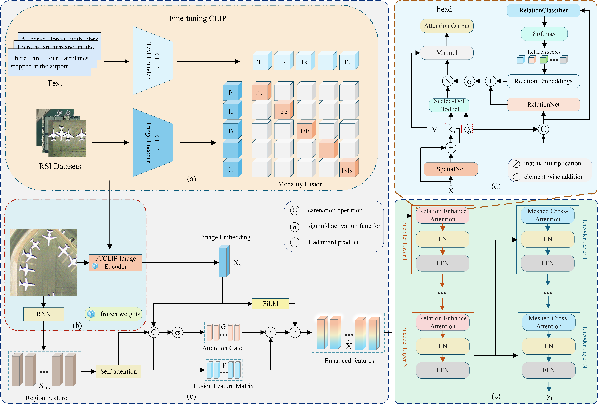

# CDRE
<p align="center">
  
</p>

## Installation and Dependencies
Create the `CDRE` conda environment using the `environment.yml` file:
```
conda env create -f environment.yml
conda activate CDRE
```
## Data preparation
For the evaluation metrics, Please download the [evaluation.zip](https://pan.baidu.com/s/1UbOYfxlKanbJH9G4D08MEA)(BaiduPan code:vb5b) and extract it to `./evaluation`.

## Train
```
python train.py
```

## Evaluate
```
python test.py
```


## Reference:
1. https://github.com/One-paper-luck/MG-Transformer

